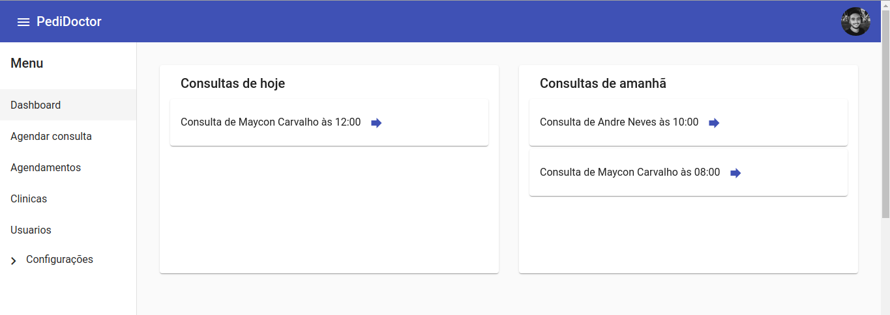

# Pedidoctor

Sistema que tem como objetivo centralizar a marcação de consultas para diferentes clínicas médicas

- Backend (Node.js): https://github.com/AndreNeves97/pedidoctor-nodejs
- Frontend (Angular): https://github.com/AndreNeves97/pedidoctor-angular


## Imagens

### Marcação de consultas


<br>

### Dashboard


<br>

### Cadastros gerais


<br>

### Cadastro de clínicas


## Instalação de dependências

```bash
$ npm install
```


## Execução em desenvolvimento


```bash
# Sem debug
$ ng serve
```

Abrir o endereço http://localhost:4200/
